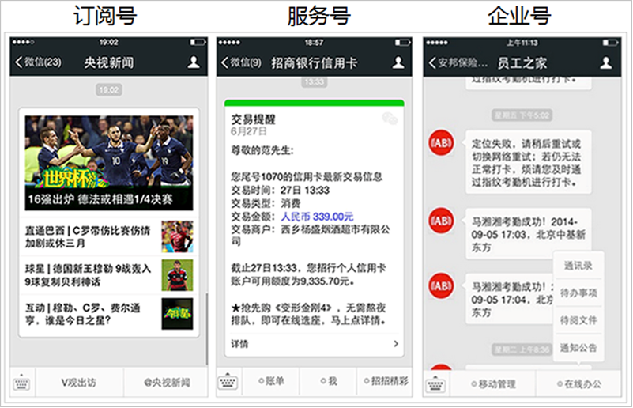
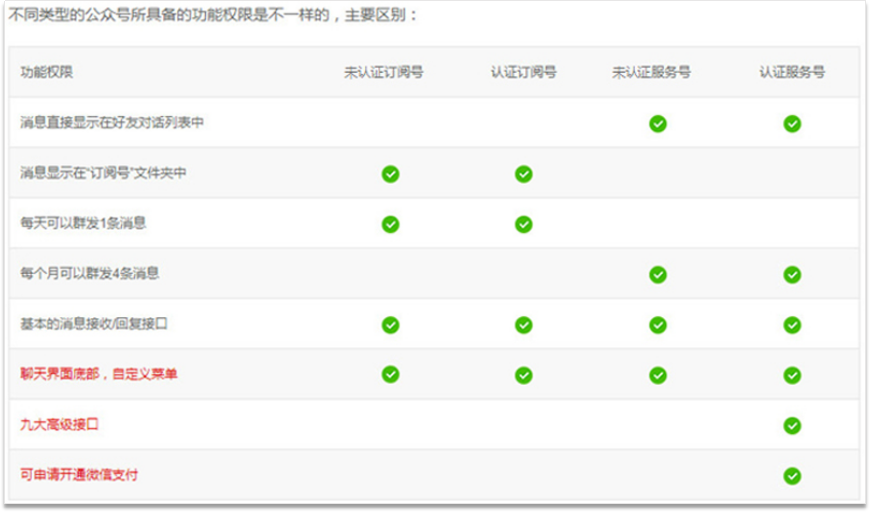
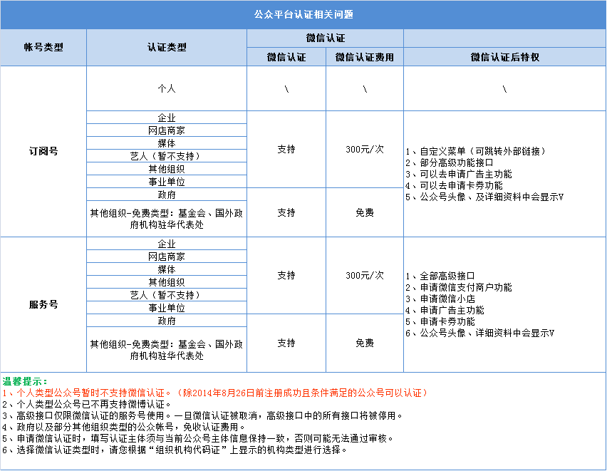
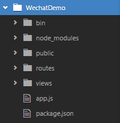
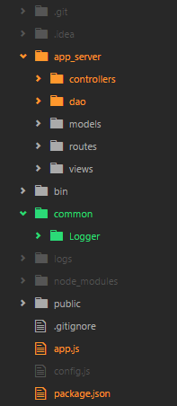
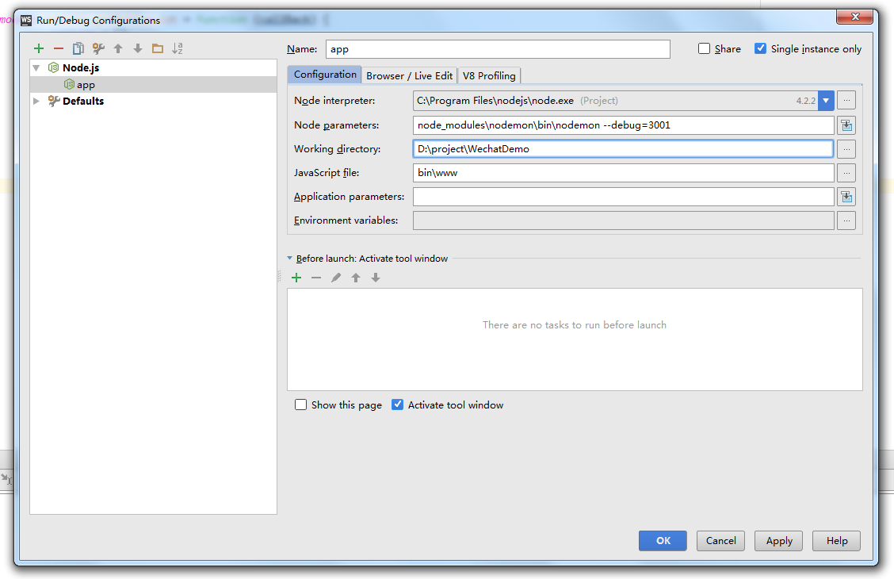

# 微信公众号开发文档(Node.js+express+winston)

## 关于订阅号、服务号、企业号
### 官方定位

> **订阅号**：主要偏于为用户传达资讯（类似报纸杂志），认证后每天可以群发一条消息，可达到宣传效果，构建与读者之间更好的沟通和管理模式。   
> **服务号**：主要偏于服务交互（类似银行，114，提供服务查询），认证前后都是每个月可群发4条消息。给企业和组织提供更强大的业务服务与用户管理能力。   
> **企业号**：主要用于公司内部通讯使用，用来管理内部企业员工、团队。   
> 

### 接口权限区别
下图展示了接口权限的区别，虽然是官方的图，但不是时分准确了，详细请看 [微信公众平台官网](https://mp.weixin.qq.com/cgi-bin/loginpage)、[开发者文档](https://mp.weixin.qq.com/wiki)
> 

### 微信认证
认证费用300元/次，需要年审，即300元/年
> 
详细请查看 [官网资料](https://kf.qq.com/faq/120322fu63YV131031NR36Fb.html)

## 关于项目


## 环境搭建
1. 安装 `node.js`，这里选择的是 v4.5.0 LTS，[node.js 官网](https://nodejs.org)
2. 安装 `express`，`$ npm install express -g`
3. 初始化项目，找到项目所要放置的文件夹，`$ express WechatDemo`，`$ cd WechatDemo`，`$ npm install`，`$ npm start`，执行完以上命令，一个最基本的基于 express 的 node 项目已经搭建好了，此时访问 `localhost:3000` 应该能看到 express 初始化的页面。

## 项目调整为 MVC 结构
项目初始化时，目录是这样的：

 

项目最终目录结构：

 

 1. 创建一个 app_server 文件夹，将根目录的 routes、views 移动到 app_server 文件夹下，再创建 controllers、dao、models 文件夹
 2. 此时如果启动项目，会报错，因为 app.js 还要相应修改如下，才能正常启动：
```javascript
var routes = require('./app_server/routes/index');
var users = require('./app_server/routes/users');
//...
app.set('views', path.join(__dirname, 'app_server', 'views'));
```
 3. 由于 routes 中，路由与业务逻辑耦合在一起了，所以将路由文件中的内容移至 controllers 中, 在 controllers 中处理业务逻辑，详细可以[查看源码](https://github.com/luckyLZH/FEPrototype/tree/master/app_server)。
 4. 增加一个 dao 文件夹，操作数据库的逻辑写在这里。
 5. 增加一个 common 文件夹，用于存放公共的组件。

## 项目调试
1. 为了不每次修改都手动重启服务器，这里采用 nodemon + WebStorm 2016.1.3 来调试项目，先安装 nodemon：`$ npm install nodemon --save`，save 是为了同步到 package.json。
2. 在 WebStorm 中，点击右上角的下拉箭头，如果没有配置过，应该是灰色的，然后选择 Edit Configurations，选择弹出框左上角的 + 号，新增一个 Node.js 项，然后配置如下：

3. 配置完成之后，点击右上角的 debug 按钮（小虫形状的按钮）即可断点调试，修改 js 文件，也可以自动重启服务器了。

## 微信公众号接入
官网：[微信公众平台](https://mp.weixin.qq.com/cgi-bin/loginpage)、[开发者文档](https://mp.weixin.qq.com/wiki)，**开始开发/接入指南** 中有讲到如何接入。

用户与微信公众号交互时，主要有两种形式：
1. 点击一个按钮，或者发送一段文字，这时，微信 app 会发送请求到微信服务器，微信服务器会转发请求到开发者的服务器。
2. 点击一个链接，这时，微信 app 不会发送请求到微信服务器，而是直接请求链接所在的服务器。

对于第一种，为了安全起见（比如可能有心怀不轨的人故意给开发者的服务器发送请求，取消某人的关注，这时开发者的程序将该用户的openid移除，此后该用户再也收不到公众号的消息，除非开发者主动刷新用户列表从微信服务器取回来。更甚者可能会对支付等比较敏感的操作进行模拟请求），微信服务器每次发来的请求都带了加密的参数，通过特定的算法可以验证该请求来自微信服务器，算法在开发者文档里写得很清楚了，在接入认证的时候就需要用这种算法响应一次微信服务端的请求。

这里采用微信官方开发的一个 npm 包 wechat 来处理请求，这意味着可以不写那套验证算法。`$npm install wecaht --save`，关于 wechat 的使用方法，请看[官方文档](https://github.com/node-webot/wechat)，写得很详细。另外可以[查看源码示例](https://github.com/luckyLZH/FEPrototype/blob/master/app_server/controllers/AutoReplyController.js)

另外，可以申请一个**测试号**，测试号几乎有所有的接口权限。

## 本地调试微信公众号
微信公众号接入的时候，是需要一台能够被微信服务器访问到的服务器，如果采用本地开发，localhost 不能被微信服务器访问到，那么就要想办法把本地服务器暴露出去，这里采用**花生壳**将本地服务器映射到外网(注册时需要付费，我注册时是15元)，但不是很稳定，偶尔映射会失败，需要重新启动软件或电脑。因为微信服务器需要接入到开发者服务器的 80 端口或者 443 端口，如果这两个端口都被占用，可用花生壳将本地 3000 的端口映射为外网 80 端口，软件挺人性化的，一个按键即可映射到外网。

## 关于 access_token
开发者每次请求微信服务器提供的接口(除了获取access_token的接口)，都需要在请求里带上 access_token 这个参数，但是这个参数的有效期只有 7200 秒，也就是两个小时，所以需要定期(setTimeout)去请求 access_token，但是如果服务器重启了，setTimeout 也就失效了，官方建议用一台独立的服务器专门获取 access_token，但如果不用独立的服务器，可以将 access_token 和 expired_in 保存到数据库。可以查看源码[ AccessTokenController.js 和 AccessTokenDao.js](https://github.com/luckyLZH/FEPrototype/tree/master/app_server)来了解详细的过程。


## 关于 log
1. 在控制台、文件、Mysql 数据库记录 log
2. 文件 log 每天记录在不同的文件
3. 每个 request.on("end") 时记录 log
4. 有需要时可以记录 log
5. 格式为：2016-08-18 17:55:02 INFO NoticeDao.js [sql:SELECT * FROM gdas_notice]

自定义 Logger API   
`logger.log`  等级默认为   'info'，接收一个字符串或者一个对象，对象会被序列化成对应的格式   
`logger.info` 与 logger.log 的作用是一样的   
`logger.warn` level 为 warn   
`logger.error` level 为 error   

自定义 log 是在 winston 的基础上写出来的，winston 没有自带 Mysql log，可以自定义，详情请看 [winston 官方文档](https://github.com/winstonjs/winston#adding-custom-transports)。
关于上面 log 的第 2 点，可以查看：[winston-daily-rotate-file](https://github.com/winstonjs/winston-daily-rotate-file)
自定义 log 也可以[查看源代码](https://github.com/luckyLZH/FEPrototype/tree/master/common/Logger)
